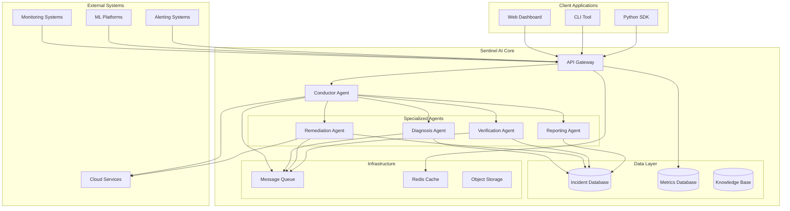

# Sentinel AI Architecture

This document describes the high-level architecture and design principles of the Sentinel AI system for automated ML incident management.

## Table of Contents

- [Overview](#overview)
- [System Architecture](#system-architecture)
- [Core Components](#core-components)
- [Agent Framework](#agent-framework)
- [Data Flow](#data-flow)
- [Integration Points](#integration-points)
- [Scalability & Performance](#scalability--performance)
- [Security](#security)
- [Deployment Architecture](#deployment-architecture)

## Overview

Sentinel AI is a distributed system designed to automatically detect, diagnose, and remediate ML incidents in production environments. The system follows a microservices architecture with event-driven communication and autonomous AI agents.

### Key Design Principles

- **Autonomous Operation**: AI agents work independently with minimal human intervention
- **Event-Driven**: Reactive system that responds to incidents and state changes
- **Scalable**: Horizontally scalable components to handle enterprise workloads
- **Resilient**: Fault-tolerant design with graceful degradation
- **Observable**: Comprehensive monitoring and logging throughout the system
- **Extensible**: Plugin architecture for custom agents and integrations

## System Architecture



## Core Components

### API Gateway

**Purpose**: Single entry point for all external requests

**Responsibilities**:
- Request routing and load balancing
- Authentication and authorization
- Rate limiting and throttling
- Request/response transformation
- API versioning
- Metrics collection

**Technology Stack**:
- FastAPI for high-performance async API
- JWT tokens for authentication
- Redis for rate limiting
- Prometheus for metrics

### Conductor Agent

**Purpose**: Central orchestrator that coordinates all other agents

**Responsibilities**:
- Incident lifecycle management
- Agent task assignment and coordination
- Workflow orchestration
- Human approval workflows
- Escalation management
- Resource allocation

**Key Features**:
- State machine-based incident processing
- Priority-based task scheduling
- Automatic escalation rules
- Human-in-the-loop integration
- Multi-agent coordination

### Specialized Agents

#### Diagnosis Agent

**Purpose**: Automated root cause analysis and incident diagnosis

**Capabilities**:
- Data drift detection and analysis
- Model performance degradation analysis
- Infrastructure issue identification
- Log analysis and pattern recognition
- Statistical anomaly detection

**ML Models Used**:
- Time series anomaly detection
- Classification models for incident categorization
- NLP models for log analysis
- Causal inference models

#### Remediation Agent

**Purpose**: Automated incident resolution and system repair

**Capabilities**:
- Model retraining automation
- Infrastructure scaling and repair
- Configuration updates
- Data pipeline fixes
- Rollback operations

**Integration Points**:
- CI/CD pipelines
- Kubernetes clusters
- Cloud provider APIs
- ML training platforms
- Data processing systems

#### Verification Agent

**Purpose**: Validation of remediation actions and system health

**Capabilities**:
- Post-remediation testing
- Model performance validation
- System health checks
- Regression testing
- Quality assurance

**Testing Framework**:
- Automated test suite execution
- A/B testing for model changes
- Canary deployment validation
- Performance benchmarking
- Data quality validation

#### Reporting Agent

**Purpose**: Incident documentation and stakeholder communication

**Capabilities**:
- Automated report generation
- Stakeholder notifications
- Incident summaries
- Trend analysis
- Compliance reporting

**Output Formats**:
- PDF reports
- Email notifications
- Slack/Teams messages
- Dashboard updates
- API webhooks

## Agent Framework

### Base Agent Architecture

```python
class BaseAgent:
    def __init__(self, agent_id: str, capabilities: List[AgentCapability]):
        self.agent_id = agent_id
        self.capabilities = capabilities
        self.state = AgentState.IDLE
        self.message_queue = MessageQueue()
        self.knowledge_base = KnowledgeBase()
    
    async def process_incident(self, incident: Incident) -> AgentAction:
        # Core processing logic
        pass
    
    async def handle_message(self, message: AgentMessage) -> None:
        # Inter-agent communication
        pass
    
    def get_capabilities(self) -> List[AgentCapability]:
        return self.capabilities
```

### Agent Communication

**Message Types**:
- `TASK_ASSIGNMENT`: New task from conductor
- `STATUS_UPDATE`: Progress updates
- `RESULT_NOTIFICATION`: Task completion
- `COLLABORATION_REQUEST`: Inter-agent coordination
- `ESCALATION`: Human intervention needed

**Communication Patterns**:
- **Request-Response**: Synchronous communication for immediate results
- **Publish-Subscribe**: Event-driven updates and notifications
- **Message Queue**: Asynchronous task processing
- **Direct Invocation**: High-priority urgent communications

### Agent State Management

```python
class AgentState(Enum):
    IDLE = "idle"
    PROCESSING = "processing"
    WAITING = "waiting"
    ERROR = "error"
    MAINTENANCE = "maintenance"
```

**State Transitions**:
- Agents maintain state in Redis for persistence
- State changes trigger events for monitoring
- Automatic recovery from error states
- Graceful shutdown and restart capabilities

## Data Flow

### Incident Creation Flow

1. **Detection**: External monitoring system detects anomaly
2. **Ingestion**: API Gateway receives incident report
3. **Validation**: Request validation and authentication
4. **Storage**: Incident stored in database
5. **Orchestration**: Conductor agent receives incident
6. **Assignment**: Tasks assigned to specialized agents
7. **Processing**: Agents execute their specialized functions
8. **Coordination**: Results shared between agents
9. **Resolution**: Incident marked as resolved
10. **Reporting**: Final reports generated and distributed

### Data Storage Strategy

**Incident Database (PostgreSQL)**:
- Primary incident data
- Agent actions and results
- Audit trails
- Relationship data

**Metrics Database (InfluxDB)**:
- Time-series performance data
- System metrics
- Agent performance metrics
- Historical trends

**Knowledge Base (Vector Database)**:
- Historical incident patterns
- Solution knowledge
- Best practices
- Agent learning data

**Object Storage (S3/GCS)**:
- Large files and artifacts
- Model checkpoints
- Log files
- Report archives

## Integration Points

### ML Platform Integrations

**Vertex AI**:
- Model training and deployment
- AutoML capabilities
- Model monitoring
- Prediction services

**MLflow**:
- Model registry
- Experiment tracking
- Model versioning
- Deployment management

**Kubeflow**:
- Pipeline orchestration
- Distributed training
- Model serving
- Workflow management

### Monitoring Integrations

**Prometheus + Grafana**:
- System metrics collection
- Custom dashboards
- Alerting rules
- Performance monitoring

**DataDog/New Relic**:
- APM integration
- Log aggregation
- Custom metrics
- Alert management

**Cloud Monitoring**:
- Native cloud metrics
- Resource utilization
- Cost monitoring
- Service health

### Communication Integrations

**Slack/Microsoft Teams**:
- Real-time notifications
- Interactive incident management
- Status updates
- Approval workflows

**Email/SMS**:
- Critical alert notifications
- Report delivery
- Escalation communications
- Scheduled summaries

**PagerDuty/Opsgenie**:
- Incident escalation
- On-call management
- SLA tracking
- Integration with existing workflows

## Scalability & Performance

### Horizontal Scaling

**Agent Scaling**:
- Multiple instances of each agent type
- Load balancing across agent instances
- Auto-scaling based on workload
- Resource-aware scheduling

**Database Scaling**:
- Read replicas for query performance
- Sharding for large datasets
- Connection pooling
- Query optimization

**Message Queue Scaling**:
- Partitioned topics for parallel processing
- Consumer groups for load distribution
- Dead letter queues for error handling
- Backpressure management

### Performance Optimization

**Caching Strategy**:
- Redis for frequently accessed data
- CDN for static assets
- Application-level caching
- Database query result caching

**Async Processing**:
- Non-blocking I/O operations
- Concurrent task execution
- Background job processing
- Stream processing for real-time data

**Resource Management**:
- CPU and memory limits per agent
- Resource quotas and priorities
- Efficient resource allocation
- Garbage collection optimization

## Security

### Authentication & Authorization

**Multi-layered Security**:
- API key authentication for external systems
- JWT tokens for user sessions
- Service-to-service authentication
- Role-based access control (RBAC)

**Authorization Model**:
```python
class Permission(Enum):
    READ_INCIDENTS = "read:incidents"
    WRITE_INCIDENTS = "write:incidents"
    EXECUTE_REMEDIATION = "execute:remediation"
    ADMIN_SYSTEM = "admin:system"

class Role:
    name: str
    permissions: List[Permission]
    
class User:
    id: str
    roles: List[Role]
    organization: str
```

### Data Protection

**Encryption**:
- TLS 1.3 for data in transit
- AES-256 for data at rest
- Key rotation policies
- Hardware security modules (HSM)

**Data Privacy**:
- PII detection and masking
- Data retention policies
- GDPR compliance
- Audit logging

### Network Security

**Infrastructure Protection**:
- VPC/VNET isolation
- Network segmentation
- Firewall rules
- DDoS protection

**API Security**:
- Rate limiting
- Input validation
- SQL injection prevention
- CORS policies

## Deployment Architecture

### Cloud-Native Deployment

**Kubernetes Architecture**:
```yaml
apiVersion: v1
kind: Namespace
metadata:
  name: sentinel-ai
---
apiVersion: apps/v1
kind: Deployment
metadata:
  name: conductor-agent
spec:
  replicas: 3
  selector:
    matchLabels:
      app: conductor-agent
  template:
    metadata:
      labels:
        app: conductor-agent
    spec:
      containers:
      - name: conductor
        image: sentinel-ai/conductor:latest
        resources:
          requests:
            memory: "512Mi"
            cpu: "500m"
          limits:
            memory: "1Gi"
            cpu: "1000m"
```

### Multi-Environment Setup

**Development Environment**:
- Single-node deployment
- In-memory databases
- Mock external services
- Debug logging enabled

**Staging Environment**:
- Production-like setup
- Scaled-down resources
- Integration testing
- Performance testing

**Production Environment**:
- High availability setup
- Auto-scaling enabled
- Monitoring and alerting
- Disaster recovery

### Infrastructure as Code

**Terraform Configuration**:
```hcl
module "sentinel_ai" {
  source = "./modules/sentinel-ai"
  
  environment = "production"
  region = "us-west-2"
  
  agent_replicas = {
    conductor = 3
    diagnosis = 5
    remediation = 3
    verification = 2
    reporting = 2
  }
  
  database_config = {
    instance_type = "db.r5.xlarge"
    storage_size = 1000
    backup_retention = 30
  }
}
```

### Monitoring & Observability

**Metrics Collection**:
- Application metrics (custom)
- Infrastructure metrics (system)
- Business metrics (KPIs)
- Security metrics (audit)

**Logging Strategy**:
- Structured logging (JSON)
- Centralized log aggregation
- Log retention policies
- Real-time log streaming

**Distributed Tracing**:
- Request tracing across services
- Performance bottleneck identification
- Error propagation tracking
- Service dependency mapping

**Health Checks**:
- Liveness probes
- Readiness probes
- Custom health endpoints
- Dependency health checks

### Disaster Recovery

**Backup Strategy**:
- Automated database backups
- Cross-region replication
- Point-in-time recovery
- Configuration backups

**Failover Procedures**:
- Automated failover for databases
- Load balancer health checks
- Circuit breaker patterns
- Graceful degradation

**Recovery Testing**:
- Regular disaster recovery drills
- Backup restoration testing
- Failover scenario testing
- Recovery time measurement

This architecture provides a robust, scalable, and maintainable foundation for the Sentinel AI system, enabling autonomous ML incident management at enterprise scale.
